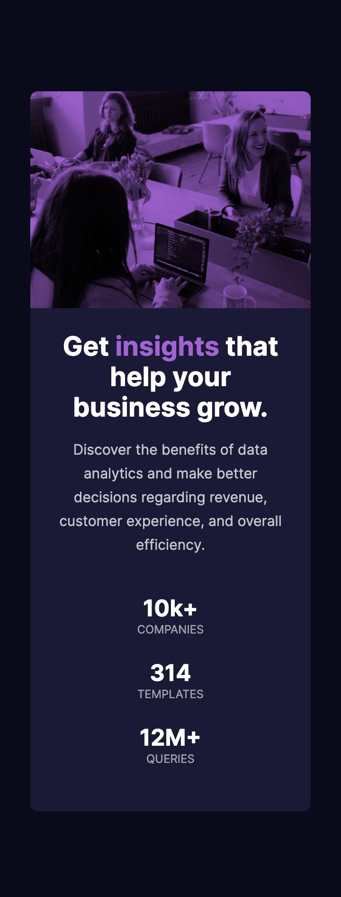

# Frontend Mentor - Stats preview card component

This is a solution to the [Stats preview card component challenge on Frontend Mentor](https://www.frontendmentor.io/challenges/stats-preview-card-component-8JqbgoU62). Frontend Mentor challenges help you improve your coding skills by building realistic projects.

## Overview

### The challenge

Users should be able to:

- View the optimal layout depending on their device's screen size

### Screenshot

### Links

- Solution URL: [GitHub](https://github.com/rparias/Stats-preview-card-component)
- Live Site URL: [GitHub Pages](https://rparias.github.io/Stats-preview-card-component/)

### Built with

- Semantic HTML5 markup
- CSS custom properties
- Flexbox
- Mobile-first workflow

### What I learned

Refreshing concepts about flexbox and how to add a color filter over an image.

## Author

- Frontend Mentor - [@rparias](https://www.frontendmentor.io/profile/rparias)
- Twitter - [@rparias\_](https://twitter.com/rparias_)

## Acknowledgments

Curious about how improve the functionality of background-size property.
